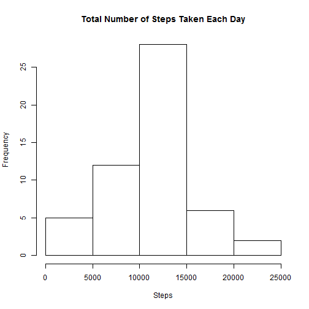
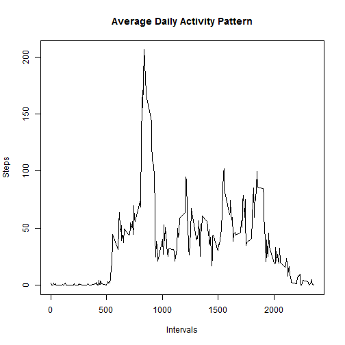
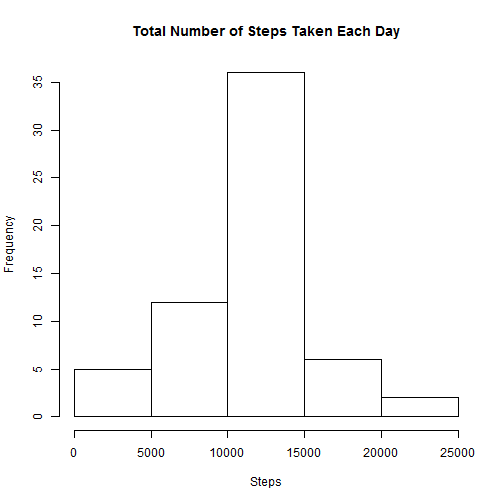
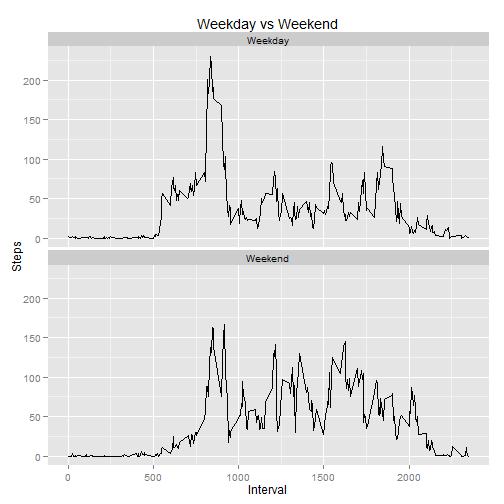

It is now possible to collect a large amount of data about personal movement using activity monitoring devices such as a Fitbit, Nike Fuelband, or Jawbone Up. These type of devices are part of the "quantified self" movement - a group of enthusiasts who take measurements about themselves regularly to improve their health, to find patterns in their behavior, or because they are tech geeks. But these data remain under-utilized both because the raw data are hard to obtain and there is a lack of statistical methods and software for processing and interpreting the data.

This assignment makes use of data from a personal activity monitoring device. This device collects data at 5 minute intervals through out the day. The data consists of two months of data from an anonymous individual collected during the months of October and November, 2012 and include the number of steps taken in 5 minute intervals each day.

## Loading and preprocessing the data

```r
#Load the libraries we need
library(plyr)
library(ggplot2)

#Load the data that we will use and change the date column to a Date
activity<-read.csv(file = unzip("activity.zip"))
activity$date<-as.Date(activity$date,"%Y-%m-%d")

#Create the daily summary
steps.daily<-ddply(activity, .(date), summarise, steps=sum(steps) )
```

## What is mean total number of steps taken per day?

```r
#Create the daily summary
steps.daily<-ddply(activity, .(date), summarise, steps=sum(steps) )

#Chart the histogram
hist(steps.daily$steps, main="Total Number of Steps Taken Each Day",xlab="Steps")
```

 


```r
#The mean and median, ignoring missing values
options(scipen = 6)
steps.mean<-mean(steps.daily$steps, na.rm = TRUE)
steps.median<-median(steps.daily$steps, na.rm = TRUE)
```

The median steps are 10765 and the mean steps are 10766.1887.

## What is the average daily activity pattern?

```r
#Create the averages for each interval over the period
steps.average<-ddply(activity, .(interval), summarise, steps=mean(steps, na.rm = TRUE))

#Chart the time series
plot(steps.average, main = "Average Daily Activity Pattern", type='l', xlab="Intervals", ylab="Steps")
```

 

```r
#Find which interval has the highest average
max.interval<-steps.average[which.max(steps.average[,"steps"]),1]
```

The interval with the highest average over the period is 835.

## Imputing missing values

```r
#Number of missing steps
missing<-sum(is.na(activity$steps))
```

The total number of missing values in the dataset is 2304.


```r
#Impute missing values - we are just going to use the average for the interval 
#over the period
#First create a data frame with the averages 
activity.rm.na<-ddply(activity, .(interval), transform, avg.steps=mean(steps, na.rm = TRUE))
#If it is missing use the average
activity.rm.na$steps<-ifelse(is.na(activity.rm.na$steps), 
                             activity.rm.na$avg.steps, 
                             activity.rm.na$steps)
#Drop the additional column
activity.rm.na<-subset(activity.rm.na,select = -c(avg.steps))

#summarise the imputed data set
steps.daily.rm.na<-ddply(activity.rm.na, .(date), summarise, steps=sum(steps) )

#Chart the histogram
hist(steps.daily.rm.na$steps, main="Total Number of Steps Taken Each Day",xlab="Steps")
```

 

```r
#Get the new mean and median
imputed.mean<-mean(steps.daily.rm.na$steps)
imputed.median<-median(steps.daily.rm.na$steps)
```

The median steps are 10766.1887 and the mean steps are 10766.1887.

The mean is the same as the original data set mean, because the values were imputed 
from the mean.  The new median is the same as the new mean for the same reason.

## Are there differences in activity patterns between weekdays and weekends?

```r
#Add a factor for weekend/weekday
activity.rm.na$Week.Day<-
        as.factor(ifelse(weekdays(activity.rm.na$date) 
                         %in% c("Saturday","Sunday"),"Weekend","Weekday"))
steps.interval.rm.na<-ddply(activity.rm.na, .(interval, Week.Day), summarise, steps=mean(steps) )
g<-ggplot(steps.interval.rm.na, aes(x = interval, y=steps))
g<-g+geom_line()+facet_wrap(~Week.Day, nrow = 2, ncol = 1)
g<-g+labs(title="Weekday vs Weekend", x="Interval", y="Steps")
print(g)
```

 


The charts show that there is more activity on weekends during the day, possibly
due to people being at work during the day on weekdays and thus lowering their activity.
